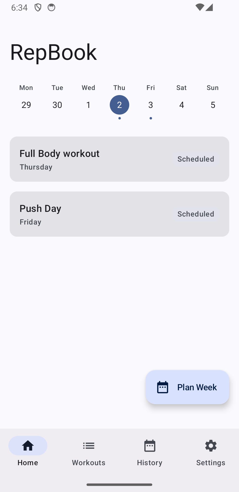
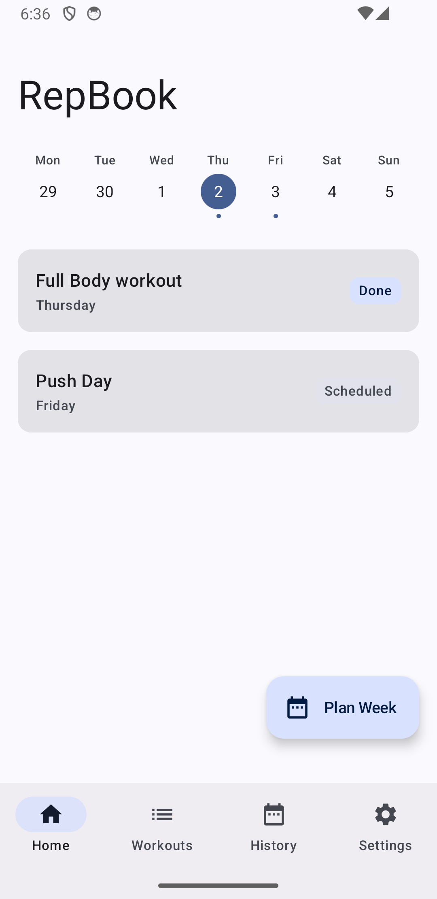
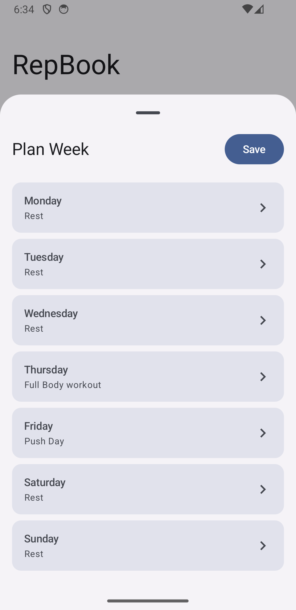
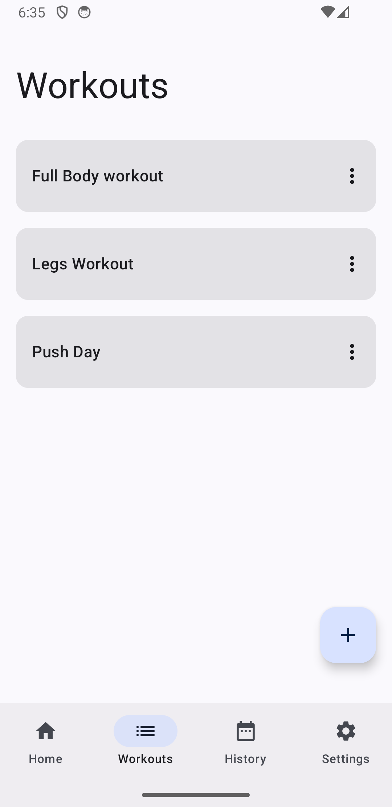
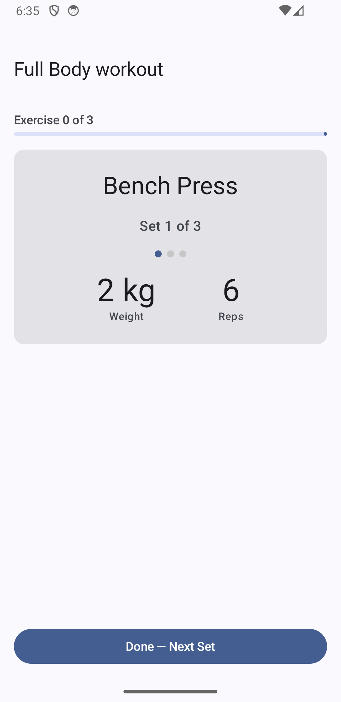
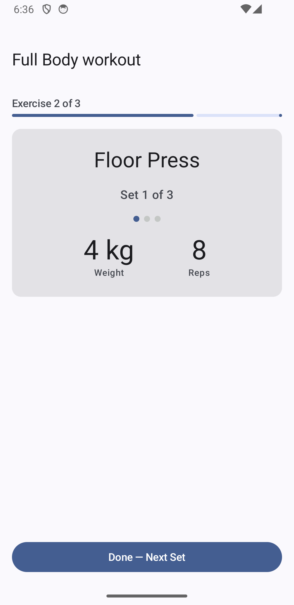
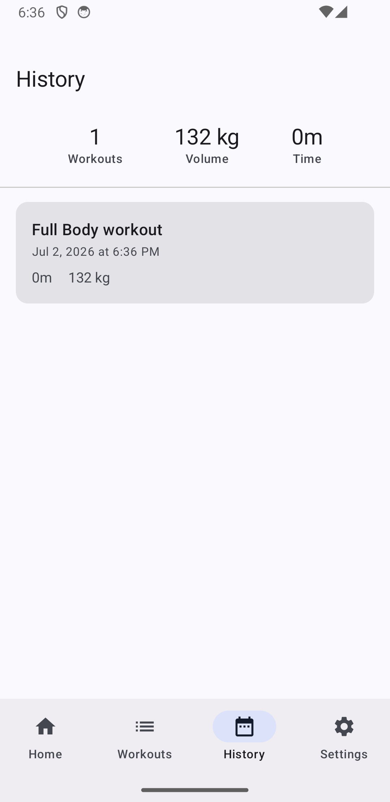

# RepBook

A simple, offline workout tracker built with Jetpack Compose that helps you create workout routine, schedule them throughout the week, and track your progress without requiring an account or internet connection.

## Features

- Weekly workout schedule
- Create and manage workouts
- Add exercises with configurable sets
- Support for weights/reps and time-based exercises
- Rest timer between sets and exercises
- Track workout completion
- Workout history and statistics
- Import and export workout data as JSON
- Light, Dark, and System theme support
- Fully offline using Room database

## Screenshots

|                                                        |                                                      |
|:------------------------------------------------------:|:----------------------------------------------------:|
|  |  |
|          Home Screen Before Starting workout           |        Home Screen After Completing a Workout        |
|                 |                  |
|                     Plan Your Week                     |       See All Your Workouts & Create New Ones        |
|                |              |
|                      Exercise One                      |                     Exercise Two                     |
|         |                                                      |
|                  Track your Workouts                   |                                                      |

## Tech Stack

- Kotlin
- Jetpack Compose
- Material 3
- Room Database
- DataStore
- MVVM Architecture
- Kotlin Coroutines & Flow

## Architecture

- Single Activity Architecture
- MVVM
- Repository Pattern
- Room for local persistence
- DataStore for application settings
- Compose Navigation

## Getting Started

```
git clone https://github.com/pparekh2009/RepBook.git
```
Open the project in Android Studio and run it on an emulator or physical device.
